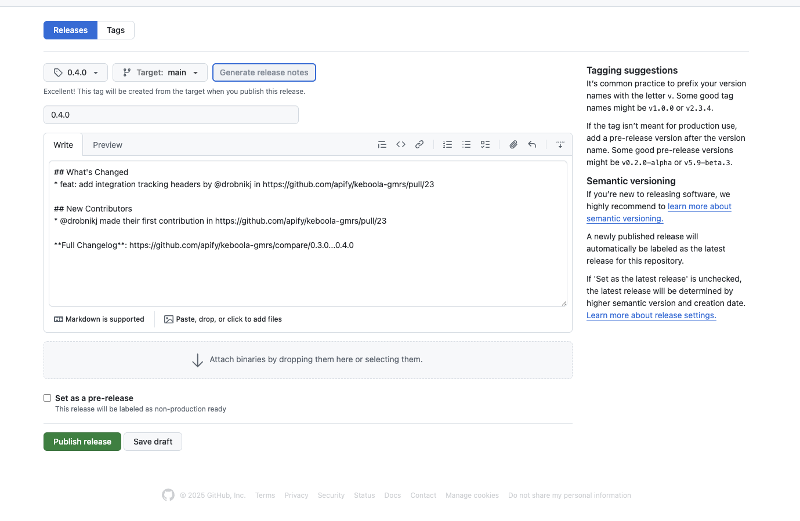

# Keboola Google Maps Reviews Scraper

## Running locally

Create `data` directory by copying `sample-config`:

```sh
cp component_config/sample-config data
```

Then, in `data/config.json`, replace `<YOUR_APIFY_API_TOKEN>` with your Apify API token. Finally, run the component:

```sh
KBC_DATADIR=data python src/component.py
```

## Deploying a new version

The recommended way to release and deploy a new version is via [GitHub Releases](https://github.com/apify/keboola-gmrs/releases):


1. Go to the GitHub Releases page for this repository.
2. Click "Draft a new release" and fill in the version, description, and changelog.
2. Changelog can be generated using "Generate release notes" button.
4. Publish the release.



Publishing a release will automatically trigger deployment via GitHub Actions. No manual deployment from the terminal is required in most cases.

### Manual deployment from terminal (advanced)

If you need to deploy manually, set the following environment variables:
- `KBC_DEVELOPERPORTAL_APP`
- `KBC_DEVELOPERPORTAL_USERNAME`
- `KBC_DEVELOPERPORTAL_VENDOR`
- `KBC_DEVELOPERPORTAL_PASSWORD`

You'll find the values in repo's [secrets](https://github.com/apify/keboola-gmrs/settings/secrets/actions) and [variables](https://github.com/apify/keboola-gmrs/settings/variables/actions).

```sh
APP_IMAGE=keboola.component
GITHUB_TAG=0.0.4
docker build -t APP_IMAGE:latest .

# Deploy the container
sh deploy.sh

# Update compontent's configs and descriptions
sh scripts/deleloper_portal/update_properties.sh
```

Deploying from terminal should not be needed. To deploy a new version, we need to push a new tag to the default branch or publish a release on GitHub, and GitHub Actions will handle the deployment.
